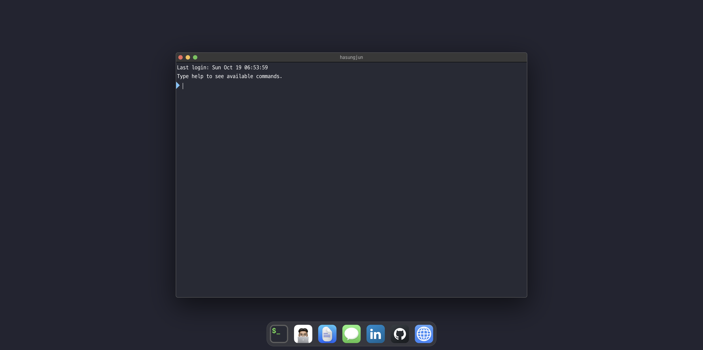

# 전하성 - 포트폴리오 웹사이트

> 제 프로젝트, 기술 스택, 경력을 보여주는 현대적이고 반응형인 포트폴리오 웹사이트입니다.

**Language:** [English](./README.md) | 한국어

---

🔗 **라이브 데모:** [hasungjun.com](https://hasungjun.com)



<!-- 스크린샷을 추가하세요 -->

## ✨ 주요 기능

- 📱 완전한 반응형 디자인
- 🌏 다국어 지원 (i18n) - 영어 & 한국어
- 🎨 부드러운 애니메이션과 현대적인 UI/UX
- ⚡ Next.js 최적화로 빠른 페이지 로딩
- 📧 연락처 폼 통합
- 🔍 SEO 최적화

## 🛠 기술 스택

- **프레임워크:** [Next.js 16](https://nextjs.org/)
- **스타일링:** [Tailwind CSS](https://tailwindcss.com/)
- **언어:** TypeScript
- **애니메이션:** Framer Motion
- **다국어:** next-intl
- **아키텍처:** Feature-Sliced Design (FSD)
- **배포:** [Vercel](https://vercel.com/)

## 🚀 시작하기

### 사전 요구사항

- Node.js 22+
- pnpm

### 설치 방법

```bash
# 저장소 클론
git clone https://github.com/iianjun/hasungjun.com.git

# 프로젝트 디렉토리로 이동
cd hasungjun.com

# 의존성 설치
pnpm install

# 개발 서버 실행
pnpm dev
```

브라우저에서 [http://localhost:3000](http://localhost:3000)을 열어 확인하세요.

## 📁 프로젝트 구조

이 프로젝트는 [Feature-Sliced Design](https://feature-sliced.design/) 아키텍처를 따릅니다:

```
hasungjun.com/
├── app/              # Next.js 앱 디렉토리 (라우팅)
├── src/
│   ├── app/          # Application 레이어 (providers, styles)
│   ├── pages/        # Pages 레이어 (페이지 구성)
│   ├── widgets/      # Widgets 레이어 (header, footer 등)
│   ├── features/     # Features 레이어 (사용자 인터랙션)
│   ├── entities/     # Entities 레이어 (비즈니스 엔티티)
│   ├── shared/       # Shared 레이어 (UI kit, utils, config)
├── public/           # 정적 파일
└── messages/         # i18n 번역 파일
```

## 🌐 배포

이 프로젝트는 Vercel에 자동으로 배포됩니다. `main` 브랜치에 푸시하면 새로운 배포가 트리거됩니다.

## 📫 연락처

- **웹사이트:** [hasungjun.com](https://hasungjun.com)
- **GitHub:** [@iianjun](https://github.com/iianjun)
- **LinkedIn:** [전하성](https://github.com/iianjun)
- **이메일:** hasungjunn@gmail.com

## 📄 라이선스

이 프로젝트는 오픈소스이며 [MIT License](LICENSE) 하에 제공됩니다.

---

⭐ 이 프로젝트가 마음에 드신다면 GitHub에서 스타를 눌러주세요!
