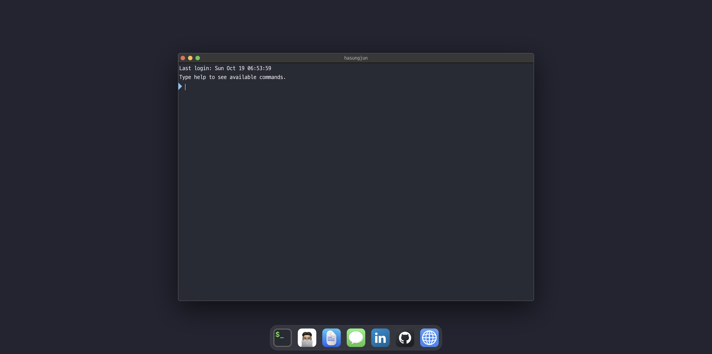

# Hasung Jun - Portfolio Website

> A modern, responsive portfolio website showcasing my projects, skills, and experience.

**Language:** English | [한국어](./README.ko.md)

---

🔗 **Live Demo:** [hasungjun.com](https://hasungjun.com)



<!-- Add your screenshot here -->

## ✨ Features

- 📱 Fully responsive design
- 🌏 Internationalization (i18n) - English & Korean support
- 🎨 Modern UI/UX with smooth animations
- ⚡ Fast page loads with Next.js optimization
- 📧 Contact form integration
- 🔍 SEO optimized

## 🛠 Built With

- **Framework:** [Next.js 16](https://nextjs.org/)
- **Styling:** [Tailwind CSS](https://tailwindcss.com/)
- **Language:** TypeScript
- **Animations:** Framer Motion
- **i18n:** next-intl
- **Architecture:** Feature-Sliced Design (FSD)
- **Deployment:** [Vercel](https://vercel.com/)

## 🚀 Getting Started

### Prerequisites

- Node.js 22+
- pnpm

### Installation

```bash
# Clone the repository
git clone https://github.com/iianjun/hasungjun.com.git

# Navigate to the project directory
cd hasungjun.com

# Install dependencies
pnpm install

# Run the development server
pnpm dev
```

Open [http://localhost:3000](http://localhost:3000) to view it in your browser.

## 📁 Project Structure

This project follows the [Feature-Sliced Design](https://feature-sliced.design/) architecture:

```
hasungjun.com/
├── app/              # Next.js app directory (routing)
├── src/
│   ├── app/          # Application layer (providers, styles)
│   ├── pages/        # Pages layer (page compositions)
│   ├── widgets/      # Widgets layer (header, footer, etc.)
│   ├── features/     # Features layer (user interactions)
│   ├── entities/     # Entities layer (business entities)
│   ├── shared/       # Shared layer (UI kit, utils, config)
├── public/           # Static assets
└── messages/         # i18n translation files
```

## 🌐 Deployment

This project is automatically deployed to Vercel. Any push to the `main` branch triggers a new deployment.

## 📫 Contact

- **Website:** [hasungjun.com](https://hasungjun.com)
- **GitHub:** [@iianjun](https://github.com/iianjun)
- **LinkedIn:** [Hasung Jun](https://github.com/iianjun)
- **Email:** hasungjunn@gmail.com

## 📄 License

This project is open source and available under the [MIT License](LICENSE).

---

⭐ If you like this project, please consider giving it a star on GitHub!
